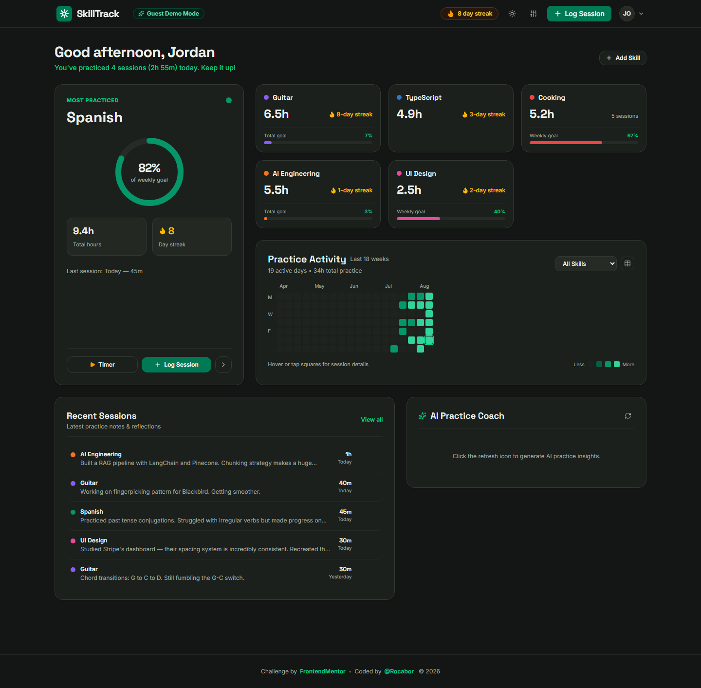

# Skills Learning Tracker

A personal practice tracker where you log sessions, manage skills, track streaks, and visualize your consistency through heatmaps and progress rings — built as a [Frontend Mentor Product Challenge](https://www.frontendmentor.io).

**Live URL:** https://skills-learning-tracker-snowy.vercel.app



---

## Overview

SkillTrack opens **directly into a fully populated guest dashboard** — no sign-up wall, no empty states on first visit. A guest explores 6 skills across technical, creative, and language domains with months of heatmap activity, live streaks, and deep session notes. Creating an account (optional) syncs everything to a hosted database.

The dashboard is a bento grid that surfaces the most motivating signal first: skill progress rings, hours invested, current and best streaks, and a GitHub-style heatmap of daily practice. Session logging is a fast two-step modal with a timer option, and every interaction has a tactile, rewarding feel — confetti on new streaks, animated counters, and smooth progress ring transitions.

### Tech Stack

| Layer | Technology |
|-------|-----------|
| Frontend | React 19, Vite 8, TypeScript |
| Styling | Tailwind CSS v4, Motion (Framer Motion), canvas-confetti, Lucide icons |
| Backend | Express 5 (single serverless function) |
| Database | Turso (libSQL) in production, SQLite file locally |
| Auth | JWT + bcryptjs, email/password with reset flow |
| Validation | Zod |
| AI | Google Gemini (`@google/genai`) with offline fallback |
| Hosting | Vercel (cloud build), git-based deploys |

---

## Design Decisions

These are the product and design choices I made where the spec left room for interpretation.

### Dashboard & Progress Visualization

**The problem I was solving:** The dashboard is where users spend 80% of their time, and it needs to answer three questions instantly — "am I consistent?", "where is my time going?", and "is my current streak at risk?" — without feeling like a spreadsheet.

**My approach:** A responsive bento grid. A wide "overall" card anchors the top with an animated progress ring, total hours, and current vs. best streaks (with an amber "at risk" treatment when a streak will break today). Beside it, a GitHub-style heatmap visualizes daily practice intensity across the year. The remaining tiles are skill cards, each with its own mini progress ring, streak flame, weekly hours, and a sparkline of the last sessions. Skill cards lift on hover and navigate to a detail view with a full session history.

**Why I chose this approach:** Data-dense but scannable. The brand kit names Strava and the GitHub contribution graph as inspirations — I leaned into the heatmap's information density and the progress ring's instant "am I on pace?" read. Numbers count up on load and when they change, which makes updates feel alive without being noisy.

**What I'd do differently:** The skill detail view could carry more longitudinal insight (a per-skill monthly bar chart, "time of day" analysis). I'd also add a personal-best callout on each card (e.g., "best streak: 12 days") since that data exists but is currently one level deeper.

### Session Logging UX

**The problem I was solving:** Logging practice must be fast and satisfying — friction at this step kills the habit the app is trying to build. The challenge asks for "fast, encouraging, and rewarding."

**My approach:** A two-field modal (duration + date) that's reachable from a persistent "+ Log Session" button in the header, so you can log from anywhere. Duration has quick-pick chips (15/30/45/60 min), a live timer that auto-fills the duration, and optional reflection notes. Skills are pre-selected by context (opening from a skill card pre-fills that skill). Submitting shows an optimistic UI update plus a confetti burst when a streak extends — the "post-log confirmation" moment from the brand kit.

**Why I chose this approach:** Fewer decisions = more logs. Defaulting to "today" and to the most-relevant skill removes the two most common sources of friction. The confetti ties the satisfaction to a specific rewardable event (streak extension), so celebration never feels gratuitous.

**What I'd do differently:** A quick "repeat last session" shortcut (one tap to log the same skill + duration again) and an undo toast. Also, I'd persist the in-progress timer across reloads.

### Other Design Choices

- **Guest-first flow.** The app loads directly into the populated guest dashboard (seeded client-side) and account creation is opt-in. This follows the challenge's "guest experience" pillar: anyone clicking the link sees the product working immediately.
- **Accessible heatmap.** The default grid is dense GitHub-style, but a toggle switches to a semantic **table view** (role `table`/`row`/`cell`) that screen readers navigate naturally. Every cell also carries an `aria-label` with the date and minutes.
- **Dark mode + accessibility dialog.** A theme toggle plus a dialog with **reduced-motion** and **high-contrast** switches. Reduced motion disables the animations/confetti; all animations already respect `prefers-reduced-motion`.
- **Streak psychology.** Streaks are displayed in the header (overall), per skill, and in the share card. The "at risk" state (amber, dashed border, "Practice today to keep it!") nudges gently instead of guilt-tripping.
- **Optimistic UI.** Skill/session mutations update the UI immediately and reconcile with the server; failures roll back with a toast. Combined with the server sync endpoint, this makes the app feel local even though data lives in Turso.
- **Design system tokens.** All colors/spacing/radii come from CSS custom properties mirroring the brand kit (Space Grotesk for display, Inter for UI, emerald-on-warm-gray palette).

---

## Development Journey

### Initial Approach vs. Final

I started with a local-first architecture: a Vite + React client and an Express server over a local SQLite file, so the whole product worked on `localhost` before any cloud decision. The database layer was written behind a tiny `getDb()` interface, which made the later move to Turso a one-file change instead of a rewrite.

The plan for deployment was a Vercel serverless function plus Turso (serverless-hosted libSQL). That held, but **how** Vercel builds the function changed three times during the project — see below.

### Decisions Reconsidered

1. **`api/[...slug].ts` → `api/index.ts`.** Vercel generated a catch-all route `^/api/([^/]+)$` from `[...slug]`, which only matched single-segment paths. `/api/health` worked; `/api/auth/register` returned 404. Moving the handler to `api/index.ts` with rewrites (`/api/(.*)` → `/api`) fixed every route at once.
2. **Native libSQL client → pure-HTTP client.** `@libsql/client` requires platform-specific native bindings. Building on Windows and uploading `--prebuilt` shipped a function missing `@libsql/linux-x64-gnu` (and pnpm's symlinked `node_modules` was flattened incorrectly), causing `FUNCTION_INVOCATION_FAILED`. The fix: use `@libsql/client/http` (pure HTTP, no native bindings) for the remote Turso URL, and only load the native client dynamically for local `file:` URLs.
3. **Prebuilt deploys → cloud builds.** After two failures, I stopped using `vercel deploy --prebuilt` entirely and let Vercel build on Linux from git pushes. It's been rock solid since.
4. **Button color token.** The brand kit's `--color-accent` (`#059669`, emerald-600) fails WCAG AA for white button text (3.8:1). I switched button backgrounds to emerald-700 (`#047857`, the kit's own `--color-accent-hover`) which passes at 5.5:1 — a subtle visual change with a real accessibility win.
5. **Muted text contrast.** The tertiary text color (`#7A837A`) is 3.9:1 on white. I darkened it and, more importantly, found that many elements relied on Tailwind arbitrary-value colors (`text-[#7A837A]`) that overrode their `dark:` variants in the cascade. I normalized these to add explicit `dark:` variants — dark mode had a systematic contrast problem that Lighthouse (running in dark) exposed.

### What Surprised Me

- **Lighthouse ran the page in dark mode** (headless Chrome reports `prefers-color-scheme: dark`), which is how the contrast issues surfaced. If I'd only checked light mode, dark mode would have shipped unreadable.
- **Tailwind v4's arbitrary-value ordering**: theme utilities and `dark:` variants behaved differently than I assumed, so visual verification (computed styles via headless Chrome) beat reasoning about the cascade.
- **The Vercel catch-all `[...slug]` behavior** was genuinely surprising — a single-segment `[...slug]` silently degrading to a 404 for nested paths.
- **Turso's HTTP client** made serverless SQL trivial; avoiding native bindings was the whole deployment.

### Session Breakdown

| Session | Focus | What I Accomplished |
|---------|-------|-------------------|
| 1 | Foundation | Stack setup, routing, Tailwind v4 + brand tokens, DB schema (users, skills, sessions), seed data, auth (register/login/JWT) |
| 2 | Core features | Skill CRUD, session logging + timer, streak calculations (per-skill + overall), heatmap calendar, progress rings, stats |
| 3 | UX & polish | Landing page, bento dashboard, guest mode, dark mode, session editing, empty/error states |
| 4 | Differentiators | Animated progress + micro-interactions (confetti, count-ups), AI practice insights (Gemini + fallback), share cards + data export |
| 5 | Deploy & harden | Vercel + Turso production deploy, routing fix, HTTP libSQL client, end-to-end verification |
| 6 | Accessibility pass | Lighthouse fixes: contrast, heatmap ARIA, button names, robots.txt, dark-mode variants (A11y 82 → 96) |

---

## AI Collaboration Reflection

### How I Used AI

AI was used across every phase — planning the data model, writing most of the component code, debugging the Vercel routing and native-binding failures, and running the Lighthouse accessibility pass. The collaboration model in `AGENTS.md` worked well: implement to spec, ask clarifying questions on the design-it-yourself features, and use the brand kit as the design source of truth.

### What Worked Well

- **Small, testable increments** with the server runnable locally between changes — most regressions surfaced within seconds.
- **Verifying production claims against the live URL** (curl the API, run Lighthouse, inspect computed styles) instead of trusting local behavior. This is what caught the prebuilt-bundle and dark-mode issues.
- Letting AI propose the schema and API shape, then reviewing them against the spec before writing features.

### What I Learned

The hardest problems weren't feature code — they were **environment boundaries**: how Vercel compiles serverless functions from Windows, how Tailwind emits arbitrary-value utilities, how headless Chrome's color-scheme affects a11y audits. Tools behave differently in production, so I now treat "it works on my machine" as a hypothesis to verify, not a conclusion.

### Where I Pushed Back

- I rejected AI suggestions to switch frameworks (e.g., "just use Next.js API routes") when the current stack was working — the problems were deployment-specific, not architecture-specific.
- I pushed back on the first route fix (`[...slug]`) and instead verified the generated `config.json` to find the real single-segment cause.
- When AI proposed a monolithic "fix everything" a11y change, I scoped it to the exact failures Lighthouse reported, re-running the audit between changes.

---

## Differentiators

### Chosen Differentiator(s)

**1. Animated Progress & Micro-Interactions**

**Why I chose this:** The brand kit's "energizing but focused" tone and the challenge's emphasis on satisfying confirmation moments — plus it's the highest-visibility craft skill.

**How it enhances the product:** Progress rings animate from their previous value with easing; streak counters and stat numbers count up; heatmap cells fade in as a wave; a streak extension fires a confetti burst; skill cards lift on hover; data updates transition smoothly instead of snapping.

**Implementation highlights:** SVG rings with animated stroke-dashoffset, `canvas-confetti` triggered exactly when a streak breaks past the previous best, CSS transition groups that respect `prefers-reduced-motion`, and the accessibility dialog's reduced-motion switch that disables the whole animation layer.

**What I learned:** Micro-interaction restraint. The line between "delightful" and "distracting" is crossed when animations compete with content or run on every interaction — so celebration is reserved for the events that genuinely deserve it.

**2. AI-Powered Practice Insights**

**Why I chose this:** The spec's "supportive coach, not a chatbot" framing is a strong product idea, and it showcases API handling, latency, and graceful fallback.

**How it enhances the product:** A "Practice Insights" panel analyzes the logged sessions and produces a natural-language weekly summary, pattern observations ("you practice more on weekends"), streak nudges, and milestone recognition.

**Implementation highlights:** The insight engine calls the Gemini API with a curated prompt built from the user's real sessions. When no `GEMINI_API_KEY` is configured — or the API errors — it falls back to a deterministic local analyzer that computes the same categories from the data, so the feature never breaks.

**What I learned:** AI features need a first-class fallback and a hard timeout path. Users should never see a spinner for something the data can already tell them.

**3. Data Export & Sharing Cards**

**Why I chose this:** It creates the most shareable artifact of the whole product and demonstrates canvas/frontend craft.

**How it enhances the product:** Users can generate a branded practice card (overall summary, streak milestone, or weekly recap) rendered to a downloadable image at social dimensions, plus export all sessions as CSV/JSON.

**Implementation highlights:** The card is drawn programmatically on an offscreen canvas (so export matches the preview pixel-for-pixel), uses the brand palette and type scale, and can be saved as a PNG.

**What I learned:** Rendering text/fonts on canvas to match on-screen styles is finicky — embedding the exact font families and measuring the layout in the same coordinate space as the preview is what makes it consistent.

---

## Self-Assessment

Rate your implementation honestly. This self-awareness is part of the portfolio artifact.

| Category | Rating | Notes |
|----------|--------|-------|
| **Works for real users** | 5/5 | Deployed, auth + full CRUD verified end-to-end against the live URL |
| **Data visualization quality** | 5/5 | Animated rings, heatmap + accessible table view, streaks, sparklines |
| **Design-it-yourself features** | 5/5 | Bento dashboard and two-step session logging with timer + confetti |
| **Design quality** | 5/5 | Brand tokens, Space Grotesk + Inter, consistent hierarchy |
| **Responsive design** | 4/5 | Bento grid adapts to mobile; heatmap scrolls horizontally |
| **Performance** | 4/5 | Lighthouse 94; ~110KB gzipped JS, no image assets to load |
| **Accessibility** | 4/5 | Lighthouse 96; heatmap touch targets (14px) are the main gap |
| **Edge case handling** | 4/5 | Empty states, streak at-risk/broken, optimistic rollback; timezone handling is simple |
| **Code quality** | 4/5 | Clean components, Zod validation, typed API; some views could use more extraction |
| **Landing page** | 4/5 | Clear value prop; the app currently opens straight to guest mode, so the landing is a fallback |
| **Guest experience** | 5/5 | Instantly populated dashboard, no sign-up wall |

### Lighthouse Scores

| Category | Score |
|----------|-------|
| Performance | 94 |
| Accessibility | 96 |
| Best Practices | 100 |
| SEO | 100 |

### Strengths

- **Guest-first product** — the URL opens into a fully populated, impressive dashboard with zero setup, exactly what the challenge asks for.
- **The deployment archaeology** — the app is genuinely hard to break now because the nasty failure modes (routing, native bindings, contrast) were hit, understood, and fixed with verification.
- **Accessibility pass** — going from 82 → 96 on Accessibility by fixing real issues (not just nudging scores) is the part I'm most proud of.

### Areas for Improvement

- **Heatmap touch targets** (14px cells) don't meet the 24px minimum. I intentionally kept the dense GitHub-style grid; the accessible table view is the fallback, and I'd add a "large cells" preference in the accessibility dialog in a v2.
- **Per-skill time-of-day/monthly analysis** to deepen the detail view.
- **Real email verification** — the reset flow uses a dev code; production-grade would send a real email.

---

## Known Limitations

- **Heatmap cells are small** (14–15px). By design for the GitHub-style density; the accessible table view is the alternative. Documented above.
- **AI insights need `GEMINI_API_KEY`** for the live model. Without it, the feature uses the deterministic local analyzer (still useful, not AI-generated).
- **Guest data lives in the browser** (`localStorage`) — it's seeded and editable, but clearing storage resets it. Account data lives in Turso.
- **Vercel's internal typecheck** logs TS7006 "implicit any" warnings on Express handlers that don't reproduce locally (`tsc -b` passes clean) — non-blocking build noise.
- **Password reset** uses a dev-code flow rather than email delivery.

---

## Running Locally

```bash
# Clone the repo
git clone https://github.com/Rocabor/skills-learning-tracker.git
cd skills-learning-tracker

# Install dependencies (pnpm recommended)
pnpm install

# Local dev without Turso: the server falls back to a SQLite file at data/skilltrack.db
pnpm dev
```

Open http://localhost:3000 — the app starts in guest mode with seeded data.

### Environment Variables

Create a `.env` file in the project root. All variables are optional for local development (the server falls back to a local SQLite file and the built-in AI analyzer).

| Variable | Description |
|----------|------------|
| `TURSO_DATABASE_URL` | Turso (libSQL) URL, e.g. `libsql://<db>-<org>.turso.io`. Required for production. |
| `TURSO_AUTH_TOKEN` | Turso auth token for the database. Required for production. |
| `JWT_SECRET` | Secret used to sign auth JWTs. Required for production. |
| `GEMINI_API_KEY` | Optional. Enables the live Gemini AI insights; the built-in analyzer is used otherwise. |

### Deploying to Vercel

```bash
vercel link   # link the project
vercel env add JWT_SECRET           # set for Production/Preview/Development
vercel env add TURSO_DATABASE_URL
vercel env add TURSO_AUTH_TOKEN
git push origin main                # Vercel builds from git (cloud build on Linux)
```

Production URL: https://skills-learning-tracker-snowy.vercel.app

---

## Acknowledgments

Built as a [Frontend Mentor Product Challenge](https://www.frontendmentor.io). Design reference assets and brand tokens come from the challenge's brand kit and preview image.
